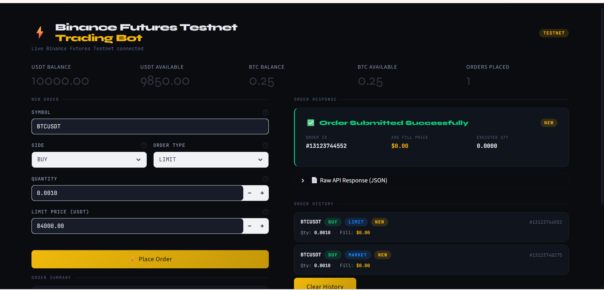
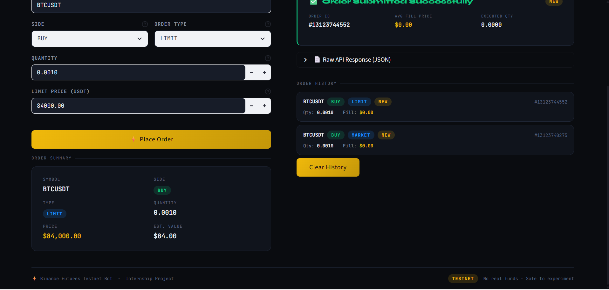

# Binance Futures Testnet Trading Bot

A Python-based Binance Futures Testnet trading bot with a professional Streamlit dashboard UI.

## Features

- Place MARKET and LIMIT orders
- Supports BUY and SELL sides
- Real Binance Futures Testnet integration
- Streamlit-based interactive dashboard
- Input validation and error handling
- API request/response logging
- Order history tracking
- Clean dark-themed UI

---

## Tech Stack

- Python 3.x
- Streamlit
- Requests
- Binance Futures Testnet API

---

## Project Structure

```bash
trading_bot/
│
├── app.py
├── orders.py
├── requirements.txt
├── README.md
├── .gitignore
│
├── logs/
│   └── trading.log
```

---

## Setup Instructions

### 1. Clone Repository

```bash
git clone https://github.com/Nisharmaa/binance-futures-trading-bot.git
cd binance-futures-trading-bot
```

### 2. Create Virtual Environment

```bash
python -m venv venv
```

### 3. Activate Virtual Environment

Windows:

```bash
venv\Scripts\activate
```

### 4. Install Dependencies

```bash
pip install -r requirements.txt
```

---

## Binance Testnet Setup

1. Open Binance Futures Testnet
2. Create Testnet API Keys
3. Add API credentials in `.env`

Example:

```env
BINANCE_API_KEY=your_api_key
BINANCE_API_SECRET=your_api_secret
```

---

## Run Application

```bash
streamlit run app.py
```

---

## Logging

Logs are stored inside:

```bash
logs/trading.log
```

Includes:
- API requests
- Successful orders
- Failed orders
- Error messages

---

## Supported Orders

- MARKET Orders
- LIMIT Orders

---

---

## Screenshots

### Market Order



### Limit Order



## Notes

- Uses Binance Futures Testnet only
- No real funds are used
- Built as part of internship assignment
